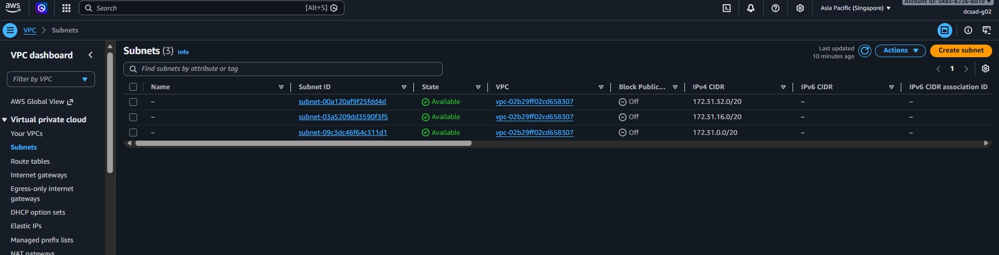
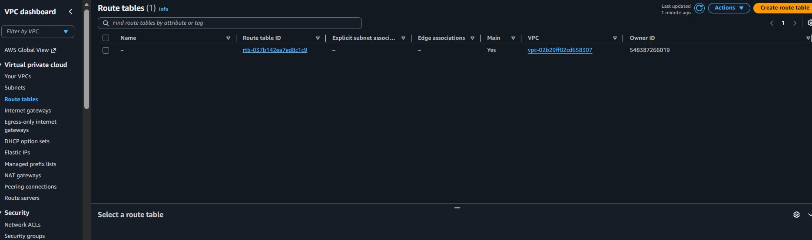
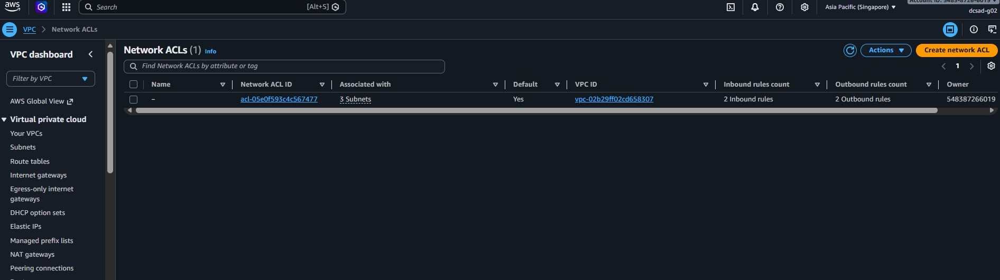
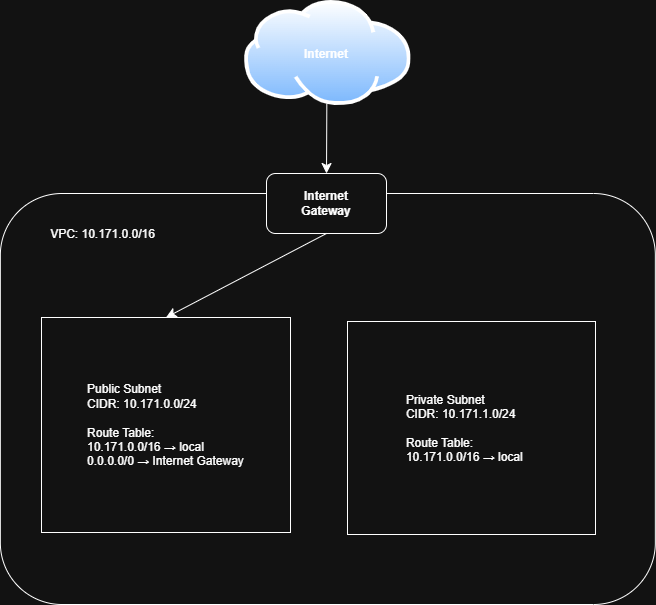

# Assignment 2 Submission

<!--
How to use this template:

1. Copy this file to submissions/assignment-2/<your-github-username>/submission.md
2. Replace every answer placeholder with your own answer. Delete the angle brackets too.
3. Save your four images in the same folder, with the exact file names below.
4. Do not write your full name or your student number in this file.
-->

## About me

- GitHub username: johnlenardtaligatos16
- Section: IV-DCSAD
- IAM user name that I signed in with: dcsad-g02
- X: 171

---

## Part A. Explore

### A1. The VPC

Default VPC IPv4 CIDR:

[ENTER THE IPv4 CIDR SHOWN FOR THE DEFAULT VPC IN AWS]

Number of addresses in that CIDR:

[ENTER THE NUMBER OF IPv4 ADDRESSES SHOWN IN AWS]

### A2. The subnets

| Availability Zone | IPv4 CIDR |
| --- | --- |
| [ENTER AWS VALUE] | [ENTER AWS VALUE] |
| [ENTER AWS VALUE] | [ENTER AWS VALUE] |
| [ENTER AWS VALUE] | [ENTER AWS VALUE] |

Screenshot 1. Save it as `screenshot-1-subnets.png` in your folder. The image line below shows it.

### A3. Available addresses

Available IPv4 addresses in each subnet:

[ENTER THE AVAILABLE IPv4 ADDRESSES SHOWN FOR EACH SUBNET IN AWS]

Why is the number lower than 4,096?

The number is lower because AWS reserves five IPv4 addresses in every subnet for networking purposes. Therefore, a /20 subnet has 4,096 total addresses but 4,091 usable addresses.

What uses the missing address in the subnet with the lowest number?

The missing addresses are reserved by AWS for network and subnet functions, including the network address, the VPC router, DNS, future use, and the broadcast address.

### A4. The route table

| Destination | Target |
| --- | --- |
| [ENTER AWS VALUE] | [ENTER AWS VALUE] |
| [ENTER AWS VALUE] | [ENTER AWS VALUE] |

Screenshot 2. Save it as `screenshot-2-routes.png` in your folder. The image line below shows it.

### A5. Public or private

Are the default subnets public or private? Which route proves it?

The default subnets are public because their route table has a `0.0.0.0/0` route that points to an Internet Gateway. This route provides a path from the subnet to the Internet Gateway.

### A6. The internet gateway

State of the internet gateway:

[ENTER THE STATE SHOWN IN AWS, FOR EXAMPLE: ATTACHED]

What happens to the default subnets if the gateway is detached?

If the Internet Gateway is detached, the default subnets can no longer use that Internet Gateway for Internet connectivity. The route to the gateway may remain in the route table, but the gateway is no longer available to provide Internet access.

### A7. NAT gateways

Number of NAT gateways:

0

Can a server in a new private subnet download updates? Why?

No. A server in a new private subnet cannot download updates from the Internet because there is no NAT Gateway providing an outbound path to the Internet. A private subnet also does not have a direct route to an Internet Gateway.

### A8. The network ACL

| Rule number | Source | Allow or Deny |
| --- | --- | --- |
| [ENTER AWS VALUE] | [ENTER AWS VALUE] | [ENTER AWS VALUE] |
| [ENTER AWS VALUE] | [ENTER AWS VALUE] | [ENTER AWS VALUE] |

How is a network ACL different from a security group?

A network ACL is a firewall that operates at the subnet level and can contain both allow and deny rules. A security group operates at the resource level and uses allow rules only; it is also stateful.

Screenshot 3. Save it as `screenshot-3-network-acl.png` in your folder. The image line below shows it.

### A9. The default security group

Inbound rule (type and source):

[ENTER THE INBOUND RULE TYPE AND SOURCE SHOWN IN YOUR AWS SECURITY GROUP]

Which resources can send traffic to an instance that uses it?

Only resources that match the inbound rules of the security group can send traffic to the instance. If the default security group has the usual self-referencing inbound rule, resources using the same security group can send traffic to the instance.

---

## Part B. Prepare

### B1. Plan two subnets

- Public subnet CIDR: `10.171.0.0/24`

- Private subnet CIDR: `10.171.1.0/24`

### B2. Route tables

Route table of the public subnet:

| Destination | Target |
| --- | --- |
| `10.171.0.0/16` | `local` |
| `0.0.0.0/0` | `Internet Gateway` |

Route table of the private subnet:

| Destination | Target |
| --- | --- |
| `10.171.0.0/16` | `local` |

### B3. My VPC diagram

Tool used (Excalidraw, draw.io, Lucidchart, or paper):

Excalidraw

Save your diagram as `vpc-diagram.png` in your folder. The image line below shows it.

### B4. Predict a change

Can you still open the web page from your laptop? Why?

No. The laptop cannot access the web page through the VPC because the `0.0.0.0/0` route to the Internet Gateway has been removed. There is no default route that provides Internet access.

Can the instance still reach another instance in the VPC? Why?

Yes. The instance can still reach another instance in the VPC because the local route for the VPC CIDR remains in the route table. The local route allows communication between resources in the VPC.

### B5. Place a database

Which subnet gets the database? Why?

The database should be placed in the private subnet because it should not be directly reachable from the public Internet. Keeping it in a private subnet provides an additional layer of network isolation.

### B6. My question about VPCs

What is your question, and what made you think of it?

Question: Why does a private subnet need a different route table from a public subnet?

I thought of this because public and private subnets have different Internet access requirements, and I wanted to understand how route tables control whether resources can communicate with the Internet.